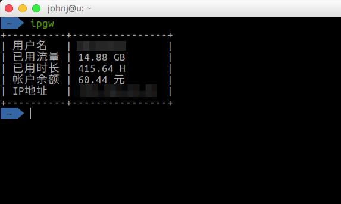

## NEU IPGW 命令行工具



### 安装
```bash
pip install ipgw
```
### 功能
1. `ipgw <id> <password>`  
运行时提供校园网账号和密码，登录IP网关。  
如果设置了环境变量`IPGW_ID`和`IPGW_PW`则可省略<id>和<password>参数，其他需要这两个参数的命令也一样。

Windows系统下可以在`我的电脑-属性-高级系统设置-环境变量`中添加新的变量，变量名分别为`IPGW_ID`和`IPGW_PW`，值分别填写自己校园网账号和密码。
> 所有的密码设置均只存在于你的本机电脑中，此工具不会保存。

*nix系统需要在`~/.bashrc`或者类似的文件中添加以下两行：  
```bash
export IPGW_ID=<your_id>
export IPGW_PW=<your_password>
```

2. `ipgw -o <id> <password>`  
退出网关。同样，如果设置了`IPGW_ID`和`IPGW_PW`变量则可省略参数。

3. `ipgw -t`  
测试当前电脑是否联网。

4. `ipgw -f`  
强制登录。如果有其他设备已登录该账号，则先强制退出，再登录。

### TODO
-[x] 查看流量使用记录
-[ ] 查看当前在线设备